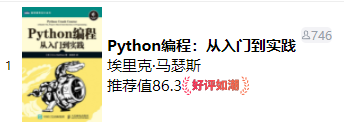
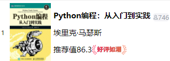
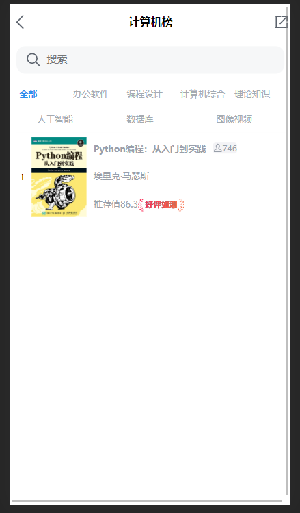

# 各种Bug

## bug1：无法居左对齐
通过调整宽度和字体大小解决

---
## bug2: 元素始终聚集在一起

<br>这里调整flex的justify content属性无法解决，设定高度可以解决.<br>

<br>但是不知道如何让flex布局中每一个元素都具有元素中的最大高度

---
## bug3: 滚动条无法消失

<br>在最开始的地方设定
```css
*
{
  box-sizing: border-box;
}
```
问题并没有解决
> <b>问题解决</b><br>
> 将整个页面中所有需要占据整个页面的元素设置宽高都为100%之后，可以将滚动条设置为只有溢出部分为auto的地方有滚动 `flex: 1; overflow: auto`。宽始终设置为100%。将所有部分的margin属性修改为padding，保证没有使页面额外撑大的元素即可去掉左右滚动条。