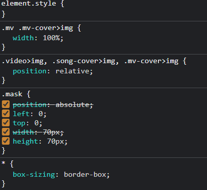

# 学习
> 学习js对文件进行读取，将读取到的文件内容插入到html文档流中
```javascript
  window.onload = function ()
  {
    var url = "task.json";
    var request = new XMLHttpRequest();
    request.open("get", url);
    request.send(null);
    request.onload = function ()
    {
      if (request.status == 200)
      {
        var json = JSON.parse(request.responseText);
        for (var i=0; i<json.length; i++)
        console.log(json[i].name);
        console.log(json);
      }
    }
  }
  ```
> 通过js改变HTML属性
```javascript
  document.getElementById("image").src="C:\Users\chi\Pictures\123jpg";
```
> 明确js需要加载的时机
`window.onload`时间会发生在图片资源加载完成之后，需要更改加载时机。
```javascript
function ready()
{
  var url = "task.json";
  var request = new XMLHttpRequest();
  request.open("get", url);
  request.send(null);
  request.onload = function ()
  {
    if (request.status == 200)
    {
      var json = JSON.parse(request.responseText);
      for (var i=0; i<json["playlist"].length; i++)
      {
        document.getElementsByClassName("cover")[i].src=json["playlist"][i]["cover"];
        console.log(json["playlist"][i]["cover"]);
      }
      console.log(json);
    }
  }
} 
document.addEventListener("DOMContentLoaded", ready) 
```

> 学会通过将一些预设样式设定特定的样式名，这样可以在定义类时，若需要此样式，直接通过样式名添加。

# 解决
> 尝试不使用flex进行文字和图片的对齐。
通过设定父标签高度，对标签内每个元素设置`vertical-align: middle`，从而使图片与文字对齐（文字默认与基线对齐，顶线、中线、基线、底线差异[点这里]）。

[点这里]: https://www.jianshu.com/p/59f31a1704de

> 将flex最后一项元素进行右对齐,只需要设置最后一项 `margin-left: auto`

> 对父元素设置宽度，子元素设置
```css
overflow: hidden;
text-overflow: ellipsis;
white-space: nowrap;
```
可以实现溢出转化为省略号且不占用额外空间，也不会影响右对齐。

> 采用grid布局时，当采用`white-space: nowrap;`属性时，布局会被破坏<br>

设置定宽（百分比）后，文字显示符合要求，但是布局仍然被破坏了。

设定定宽（像素值）后，布局符合要求，但是伸缩能力失去了。


## 文字与图片对齐
```css
.parent
{
  display: flex;
  justify-content: center;
}
.img
{
  display: block;
}
```
> 宽度属性失效



僵硬的解决办法：
```css
top: -50%;
transform: scale(0.3)
```