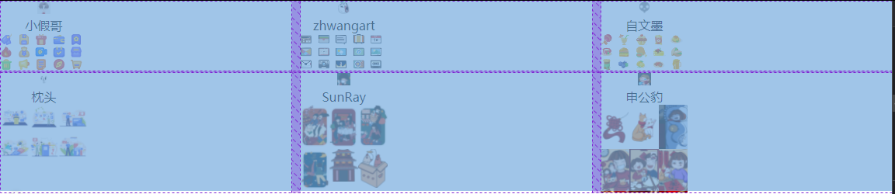

# bug
> 在编写JS脚本时，使用`document.getElementsByClassName("icons")[count]`时会显示该对象为undefined类型，但是直接采用f12不会报错
```javascript
let temp =document.getElementsByClassName("icons");
  undefined
temp[0]
  <div class=​"icons">​ ​</div>​
temp[0].innerHTML = 'html'
  "html"
```
问题解决，加载时机不对，监听DOMContentedLoaded事件即可。

> 在使用let 给`let cover = user_info["avatar"];`对象命名时，声明于判断语句内的变量无法被判断语句后面使用。

在外部声明或者内部直接声明为var变量。

> 使用grid布局，不居中的问题
<br>
取消对父元素的宽度设定即可解决`.author{/* height: 50%; */}`

> 网格中svg图像不居中且过小
`transform: scale(1.5) translateX(50%)`

> 去掉初始加载时的过渡动画
在父类添加`class="demo`,再添加`demo{transition: none;}`,最后补充脚本
```html
<script>
$(window).on('load', function() {
    $("body").removeClass("demo");
});
</script>
```